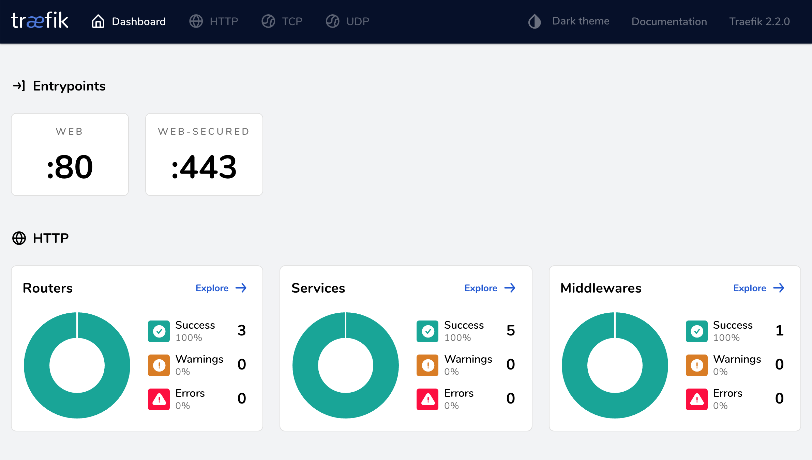

# Base Proxy/Load Balancer

## Why?

- Docker on Digitalocean
- HTTPS with Let's encrypt
- Proxy
- Automatically discover Docker stack containers (with labels)
- This can be used any DO droplet with Docker

## What for

This docker stack is a base for web development (at digitalocean)

When correctly set up the "labels" section in docker-compose.yml, Traefik automatically discovers containers and routes of subdirectories. Besides, Traefik redirects routes to https with Let's Encrypt. No restarting nor resetting a web server required. Traefik handles it

## Set up

### docker-compose.yml

1. Install Docker and Docker-compose at a new server/droplet first and then

- \$ docker-compose up -d

### docker swarm mode

TODO

Treafik Dashboard (/dashboard)

## Reference

https://docs.traefik.io/user-guides/docker-compose/acme-tls/
